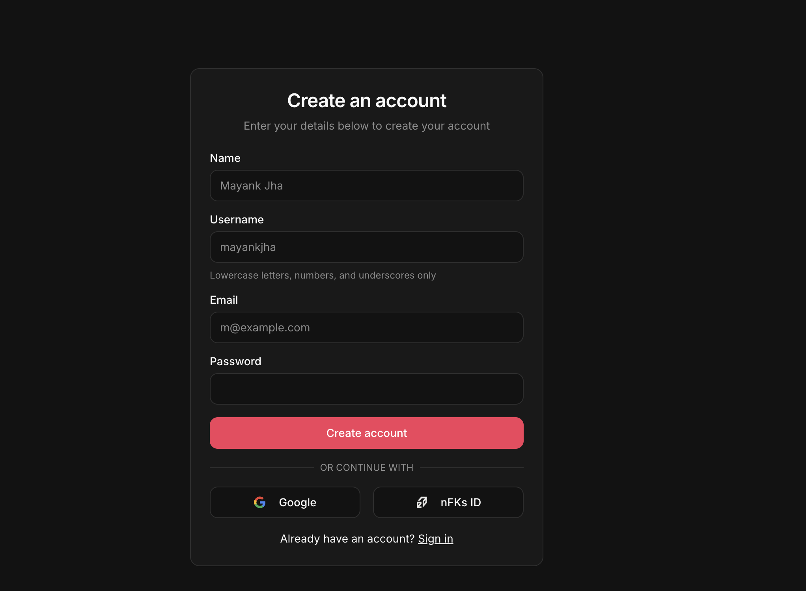

# How to Integrate nFKs ID with AyScroll

Since **AyScroll** uses Supabase as well, integrating nFKs ID is very straightforward. You will use the tokens returned (Access & Refresh tokens) to instantly create a session in AyScroll.

## 1. Create a Login Button in AyScroll

In your `Login` page or component, add a button that redirects the user to your nFKs ID Auth Portal.

```tsx
// src/components/LoginWithNFKs.tsx

const AUTH_PORTAL_URL = "http://localhost:5173"; // Change this to https://auth.nfks.co.in in production
const CLIENT_ID = "ayscroll";
const REDIRECT_URI = window.location.origin + "/auth/callback"; // e.g., http://localhost:5173/auth/callback

export function LoginWithNFKs() {
  const handleLogin = () => {
    // Generate a secure random state (optional but recommended)
    const state = Math.random().toString(36).substring(7);
    localStorage.setItem('oauth_state', state);

    // Build the URL
    const authUrl = new URL(`${AUTH_PORTAL_URL}/login`);
    authUrl.searchParams.set('client_id', CLIENT_ID);
    authUrl.searchParams.set('redirect_uri', REDIRECT_URI);
    authUrl.searchParams.set('state', state);

    // Redirect the user
    window.location.href = authUrl.toString();
  };

  return (
    <button 
      onClick={handleLogin} 
      className="w-full h-11 bg-transparent border border-zinc-700 hover:bg-zinc-800 text-white rounded-lg flex items-center justify-center gap-2 font-medium transition-all"
    >
      {/* 
         Make sure to grab the nFKs logo from your assets 
         or use a placeholder SVG if needed.
       */}
      
      nFKs ID
    </button>
  );
}
```

## 2. Create the Callback Page

You need a route that matches the `REDIRECT_URI` (e.g., `/auth/callback`) to handle the returning user. This page will extract the tokens from the URL hash and set them in your Supabase client.

Make sure you have this route defined in your `App.tsx` or `routes.tsx`.

```tsx
// src/pages/AuthCallback.tsx
import { useEffect } from 'react';
import { useNavigate } from 'react-router-dom';
import { supabase } from '../lib/supabase'; // Your AyScroll Supabase client

export default function AuthCallback() {
  const navigate = useNavigate();

  useEffect(() => {
    const handleCallback = async () => {
      // 1. Parse the Hash parameters
      const hash = window.location.hash.substring(1); // remove the '#'
      const params = new URLSearchParams(hash);
      
      const accessToken = params.get('access_token');
      const refreshToken = params.get('refresh_token');
      const error = params.get('error');

      if (error) {
        console.error("Auth error:", params.get('error_description'));
        navigate('/login?error=' + error);
        return;
      }

      if (accessToken && refreshToken) {
        // 2. Set the session in AyScroll's Supabase client
        const { error: sessionError } = await supabase.auth.setSession({
          access_token: accessToken,
          refresh_token: refreshToken,
        });

        if (sessionError) {
          console.error("Failed to set session", sessionError);
          navigate('/login');
        } else {
          // Success! User is logged in.
          console.log("Successfully logged in via nFKs ID");
          navigate('/dashboard'); // or wherever you want them to go
        }
      } else {
         navigate('/login');
      }
    };

    handleCallback();
  }, [navigate]);

  return (
    <div className="flex items-center justify-center min-h-screen bg-black text-white">
      <div className="flex flex-col items-center gap-4">
        <div className="w-8 h-8 border-2 border-white/20 border-t-white rounded-full animate-spin"></div>
        <p>Authenticating with nFKs ID...</p>
      </div>
    </div>
  );
}
```

## 3. Register the Redirect URI

Ensure that your `redirect_uri` is whitelisted in your `oauth_clients` table in Supabase (the nFKs ID database).

In your `oauth_schema.sql` (which you should have run), we already added:
- `http://localhost:5173`
- `http://localhost:3000`
- `https://ayscroll.com`

If your callback URL is `http://localhost:5173/auth/callback`, you might need to update the allowed URIs or just ensure checking logic allows it (currently `startsWith` logic is used in Consent.tsx, so `http://localhost:5173` covers any sub-path).

## UI Design Reference
